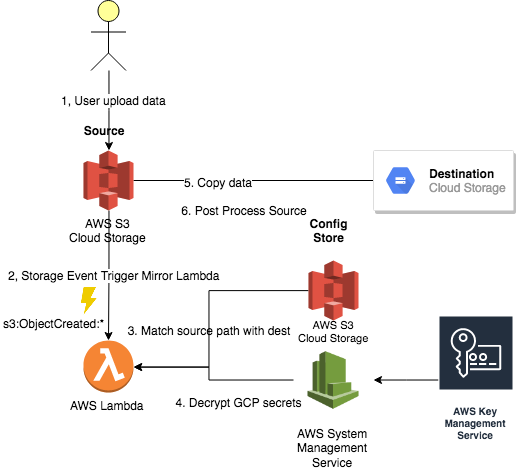

# smirror - Serverless Cloud Storage Mirror

[](https://goreportcard.com/report/github.com/viant/smirror)
[](https://godoc.org/github.com/viant/smirror)

This library is compatible with Go 1.11+

Please refer to [`CHANGELOG.md`](CHANGELOG.md) if you encounter breaking changes.


- [Motivation](#motivation)
- [Introduction](#introduction)
- [Usage](#usage)
   * [GS to S3 Mirror](#gs-to-s3-mirror)
   * [S3 to G3 Mirror](#s3-to-gs-mirror)
- [End to end testing](#end-to-end-testing)
- [Monitoring and limitation](#monitoring-and-limitation)
- [Code Coverage](#code-coverage)
- [License](#license)
- [Credits and Acknowledgements](#credits-and-acknowledgements)


## Motivation

When dealing with various cloud providers, it is a frequent use case to move seamlessly data from one cloud storage to another. 
In some scenarios, you may also need to split transferred content into a few smaller chunks. 
In any cases facilitating compression and post processing for both successful and failed transfer would be just additional requirement.


## Introduction

This project provide serverless implementation for cloud storage mirror. All external secrets/credentials are secured with KMS. 

**Google Storage to S3 Mirror**

[](images/g3Tos3Mirror.png)


## Usage

### GS to S3 mirror

To mirror data from google storage that match /data/ prefix and '.csv.gz' suffix to s3://destBucket/data
preserving parent folder (folderDepth:1) the following configuration can be used with Mirror cloud function

[@gs://sourceBucket/config/config.json](usage/gs_to_s3/config.json)
```json
{
   "Routes": [
     {
       "Prefix": "/data/",
       "Suffix": ".csv.gz",
       "Dest": {
         "URL": "s3://destBucket/data",
         "Credentials": {
           "URL": "gs://sourceBucket/secret/s3-cred.json.enc",
           "Key": "projects/my_project/locations/us-central1/keyRings/my_ring/cryptoKeys/my_key"
         }
       },
       "OnCompletion": {
         "OnSuccess": [
           {
             "Action": "delete"
           }
         ],
         "OnError": [
           {
             "Action": "move",
             "URL": "gs://sourceBucket/data/errors/"
           }
         ]
       },
       "Codec": "gzip",
       "FolderDepth": 1
     },
     {
       "Filter": "^\/[a-z]+/data/\\d+/",
       "Suffix": ".csv.gz",
       "Dest": {
         "URL": "s3://destBucket/data/chunks/",
         "Credentials": {
           "URL": "gs://sourceBucket/secret/s3-cred.json.enc",
           "Key": "projects/my_project/locations/us-central1/keyRings/my_ring/cryptoKeys/my_key"
         }
       },
       "Split": {
         "MaxLines": 10000,
         "Template": "%s_%05d"
       },
       "OnCompletion": {
         "OnSuccess": [
           {
             "Action": "delete"
           }
         ],
         "OnError": [
           {
             "Action": "move",
             "URL": "gs://sourceBucket/data/errors/"
           }
         ]
       },
       "Codec": "gzip",
       "FolderDepth": 1
     }
   ]
 }
```

###### Encrypting AWS credentials with GCP KMS 

In our example s3-cred.json.enc is encrypted version of [@s3-cred.json](usage/gs_to_s3/s3-cred.json) storing AWS credentials.

The following step can be used to encrypt a file.

- With **endly cli**


```bash
endly encryt
```

[@encrypt.yaml](usage/gs_to_s3/encrypt.yaml)
```yaml
init:
  gsBucket: e2etst
pipeline:
  secure:
    deployKey:
      action: gcp/kms:deployKey
      credentials: gcp-e2e
      ring: my_ring
      key: my_key
      logging: false
      purpose: ENCRYPT_DECRYPT
      bindings:
        - role: roles/cloudkms.cryptoKeyEncrypterDecrypter
          members:
            - serviceAccount:$gcp.serviceAccount

    keyInfo:
      action: print
      message: 'Deployed Key: ${deployKey.Name}'

    encrypt:
      action: gcp/kms:encrypt
      logging: false
      ring: my_ring
      key: my_key
      source:
        URL: s3-cred.json
      dest:
        credentials: gcp-e2e
        URL: gs://$gsBucket/mirror/config/s3-cred.json.enc
    info:
      action: print
      message: ${encrypt.CipherBase64Text}

```

Where [gcp-credentials](https://github.com/viant/endly/tree/master/doc/secrets#gc) is service account based GCP secrets
stored in ~/.secret/gcp-credentials.json


- With **gcloud cli**

```bash

gcloud kms keyrings create my_ring --location us-central1
gcloud kms keys create my_key --location us-central1 \
  --keyring my_ring --purpose encryption

## Encrypt s3-cred.json

gcloud kms encrypt \
  --location=us-central1  \
  --keyring=my_ring \
  --key=my_key \
  --version=1 \
  --plaintext-file=s3-cred.json \
  --ciphertext-file=s3-cred.json.enc

## Upload encrypted version to google storage

gsutil cp s3-cred.json.enc gs://sourceBucket/secret/s3-cred.json.enc

```

###### Deploying cloud function


- With **endly cli**

```bash
endly deploy
```

[@deploy.yaml](usage/gs_to_s3/deploy.yaml)
```yaml
init:
  appPath: $Pwd(../..)
  gsBucket: e2etst

pipeline:

  package:
    action: exec:run
    target: $target
    commands:
      - unset GOPATH
      - cd ${appPath}
      - export GO111MODULE=on
      - go mod vendor

  deploy:
    action: gcp/cloudfunctions:deploy
    credentials: gcp-e2e
    '@name': MyGsBucketToS3Mirror
    entryPoint: Fn
    runtime: go111
    availableMemoryMb: 512
    eventTrigger:
      eventType: google.storage.object.finalize
      resource: projects/_/buckets/${gsBucket}
    environmentVariables:
      LOGGING: 'true'
      CONFIG: gs://gsBucket/mirror/config/gs.json
    source:
      URL: ${appPath}/
    sleepTimeMs: 5000
```


- With **gcloud cli**

```bash
unset GOPATH
export GO111MODULE=on
go mod vendor

gcloud functions deploy MyGsBucketToS3Mirror --entry-point Fn \ 
    --trigger-resource e2etst 
    --trigger-event google.storage.object.finalize \
    --set-env-vars=LOGGING=true,CONFIG=gs://gsBucket/mirror/config/gs.json \
    --memory=512M \
    --timeout=500s \
    --runtime=go111 
```

### S3 to GS mirror

[](images/s3to_gs_mirror.png)


To mirror data from S3 that match /data/ prefix and '.csv.gz' suffix to gs://destBucket/data
preserving parent folder (folderDepth:1) the following configuration can be used with Mirror cloud function

[@gs://sourceBucket/config/config.json](usage/s3_to_gs/config.json)
```json
{
  "Routes": [
    {
      "Prefix": "/data/",
      "Suffix": ".csv.gz",
      "Dest": {
        "URL": "gs://destBucket/data",
        "Credentials": {
          "Parameter": "smirror.gs",
          "Key": "smirror"
        }
      },
      "OnCompletion": {
        "OnSuccess": [
          {
            "Action": "delete"
          }
        ],
        "OnError": [
          {
            "Action": "move",
            "URL": "s3://sourceBucket/data/errors/"
          }
        ]
      },
      "Codec": "gzip",
      "FolderDepth": 1
    },
    {
      "Prefix": "/large/data/",
      "Suffix": ".csv.gz",
      "Dest": {
        "URL": "gs://destBucket/data/chunks/",
        "Credentials": {
          "Parameter": "smirror.gs",
          "Key": "smirror"
        }
      },
      "Split": {
        "MaxLines": 10000,
        "Template": "%s_%05d"
      },
      "OnCompletion": {
        "OnSuccess": [
          {
            "Action": "delete"
          }
        ],
        "OnError": [
          {
            "Action": "move",
            "URL": "s3://sourceBucket/data/errors/"
          }
        ]
      },
      "Codec": "gzip",
      "FolderDepth": 1
    }
  ]
}
```


###### Encrypting AWS credentials with GCP KMS 

In our example AWS System Manager  'smirror.gcp' parameters is encrypted version of [@gcp-cred.json](usage/s3_to_gs/gcp-cred.json) Google Secrets.

The following step can be used to encrypt a google secrets.

- With **endly cli**

[@encrypt.yaml](usage/s3_to_gs/encrypt.yaml)
```yaml
init:
  awsCredentials: aws-e2e
  gcpSecrets: $Cat(gcp-cred.json)

pipeline:
  secure:
    credentials: $awsCredentials
    action: aws/kms:setupKey
    aliasName: alias/smirror

  encrypt:
    action: aws/ssm:setParameter
    name: smirror.gcp
    '@description': Google Storage credentials
    type: SecureString
    keyId: alias/smirror
    value: $gcpSecrets
```


- With **aws cli**

```bash
- aws kms create-key  
- aws kms create-alias --alias-name=smirror --target-key-id=KEY_ID
- aws ssm put-parameter \
    --name "smirror.gs" \
    --value 'CONTENT OF GOOGLE SECRETE HERE' \
    --type SecureString \
    --key-id alias/smirror

```


###### Deploying lambda

- With **endly cli**

```bash
endly deploy
```

[@deploy.yaml](usage/s3_to_gs/deploy.yaml)
```yaml
init:
  appPath: $Pwd(../..)
  gsBucket: e2etst
  codeZip: ${appPath}/aws/smirror.zip
  functionName: E2etstMirror
  privilegePolicy: privilege-policy.json
  awsCredentials: aws-e2e

pipeline:

  package:
    action: exec:run
    target: $target
    checkError: true
    commands:
      - unset GOPATH
      - cd ${appPath}
      - export GO111MODULE=on
      - go mod vendor
      - export GOOS=linux
      - export GOARCH=amd64
      - cd aws
      - go build -o smirror
      - zip -j smirror.zip smirror

  deployLambda:
    action: aws/lambda:deploy
    credentials: $awsCredentials
    functionname: $functionName
    runtime:  go1.x
    handler: smirror
    timeout: 360
    environment:
      variables:
        LOGGING: 'true'
        CONFIG: s3://${s3Bucket}/e2e-mirror/config/mirror.json
    code:
      zipfile: $LoadBinary(${codeZip})
    rolename: lambda-${functionName}-executor
    define:
      - policyname: kms-${functionName}-role
        policydocument: $Cat('${privilegePolicy}')
    attach:
      - policyarn: arn:aws:iam::aws:policy/service-role/AWSLambdaBasicExecutionRole
  setTrigger:
      action: aws/s3:setupBucketNotification
      sleepTimeMs: 20000
      bucket: ${s3Bucket}
      lambdaFunctionConfigurations:
        - functionName: $functionName
          id: ObjectCreatedEvents
          events:
            - s3:ObjectCreated:*
          filter:
            prefix:
              - data 
```

- With **aws cli** 
-[Serverless-deploying](https://docs.aws.amazon.com/lambda/latest/dg/with-userapp.html)

- With **sam cli**
-[Serverless-deploying](https://docs.aws.amazon.com/serverless-application-model/latest/developerguide/serverless-deploying.html)

## End to end testing


### Prerequisites:

  - [Endly e2e runner](https://github.com/viant/endly/releases) or [endly docker image](https://github.com/viant/endly/tree/master/docker)
  - [Google secrets](https://github.com/viant/endly/tree/master/doc/secrets#google-cloud-credentials) for dedicated e2e project  ~/.secret/gcp-e2e.json 
  - [AWS secrets](https://github.com/viant/endly/tree/master/doc/secrets#asw-credentials) for dedicated e2e account ~/.secret/aws-e2e.json 


```bash
git clone https://github.com/viant/smirror.git
cd smirror/e2e
### Update mirrors bucket for both S3, GS in e2e/run.yaml (gsBucket, s3Bucket)
endly 
```

## Monitoring and limitation


## Code Coverage

[](https://gocover.io/github.com/viant/smirror)

	
<a name="License"></a>
## License

The source code is made available under the terms of the Apache License, Version 2, as stated in the file `LICENSE`.

Individual files may be made available under their own specific license,
all compatible with Apache License, Version 2. Please see individual files for details.


<a name="Credits-and-Acknowledgements"></a>

## Credits and Acknowledgements

**Library Author:** Adrian Witas

